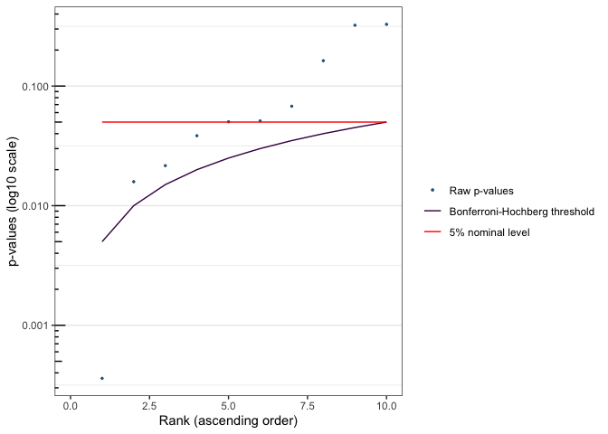
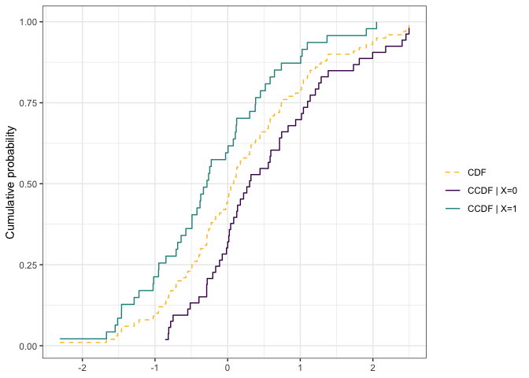

<!-- README.md is generated from README.Rmd. Please edit that file -->

# `citcdf` 

[](https://CRAN.R-project.org/package=citcdf)
[](https://github.com/sistm/citcdf/actions)

## Overview

`citcdf` is a package to perform conditional independence testing using
empirical conditional cumulative distribution function estimations.

The package has two main entry points: `cit_multi()` for gene-wise
conditional independence testing across many outcomes, and `cit_gsa()`
for gene-set analysis. Both accept `test = "asymptotic"` (large samples)
or `test = "permutation"` (small samples). The single-outcome workhorses
`cit_asymp()` and `cit_perm()`, the CCDF estimator `ccdf()`, and the
plotting functions `plot_compare_ccdf()`, `plot.cit_multi()` and
`plot.cit_gsa()` are also exported.

The approach implemented in this package is detailed in the following
article:

> Gauthier M, Agniel D, Thiébaut R & Hejblum BP (2020).
> Distribution-free complex hypothesis testing for single-cell RNA-seq
> differential expression analysis, *BioRxiv*
> [doi:10.1101/2021.05.21.445165](https://doi.org/10.1101/2021.05.21.445165)

## Installation

**`citcdf` is available on
[CRAN](https://CRAN.R-project.org/package=citcdf):**

``` r
install.packages("citcdf")
```

**The development version is available from
[GitHub](https://github.com/sistm/citcdf):**

``` r
# install.packages("remotes")
remotes::install_github("sistm/citcdf")
```

## Example

Here is a basic example which shows how to use `citcdf` with simple
generated data.

``` r
library(citcdf)
```

``` r
## Data Generation
set.seed(123)
n <- 100
X <- data.frame(X1 = as.factor(rbinom(n = n, size = 1, prob = 0.5)))
Y <- replicate(10, (X$X1 == 1) * rnorm(n) + (X$X1 == 0) * rnorm(n, mean = 0.5))
```

``` r
# Hypothesis testing
res_asymp <- cit_multi(M = data.frame(Y = Y), X = X,
                       test = "asymptotic", parallel = FALSE) # asymptotic test
res_asymp$pvals
#>          raw_pval    adj_pval test_statistic
#> Y.1  0.0003601504 0.003601504      30.418136
#> Y.2  0.3282920437 0.328292044       4.115804
#> Y.3  0.3225103024 0.328292044       4.372046
#> Y.4  0.0384303687 0.085257670      11.802747
#> Y.5  0.0678438958 0.096919851      10.451354
#> Y.6  0.0502973835 0.085257670      12.780768
#> Y.7  0.0158684748 0.072020162      15.581473
#> Y.8  0.0216060487 0.072020162      14.080686
#> Y.9  0.0511546022 0.085257670       8.920593
#> Y.10 0.1628874626 0.203609328       6.991416
plot(res_asymp)
```

<!-- -->

``` r
plot_compare_ccdf(Y=Y[, 1, drop=FALSE], X=X)
```

<!-- -->

– Marine Gauthier, Denis Agniel, Sara Fallet, Kalidou Ba, Rodolphe
Thiébaut & Boris Hejblum

*hex illustration by Jérôme Dubois.*
