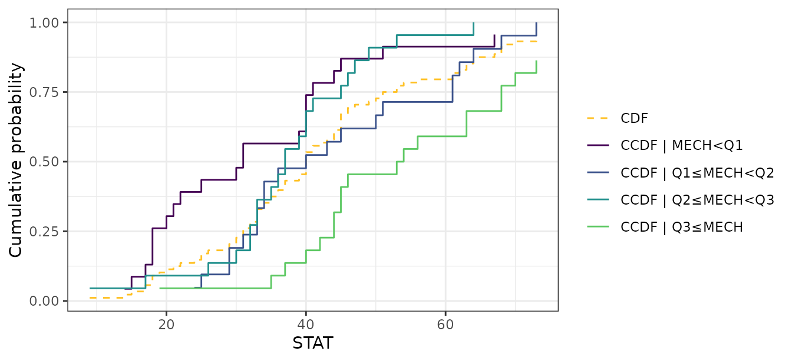
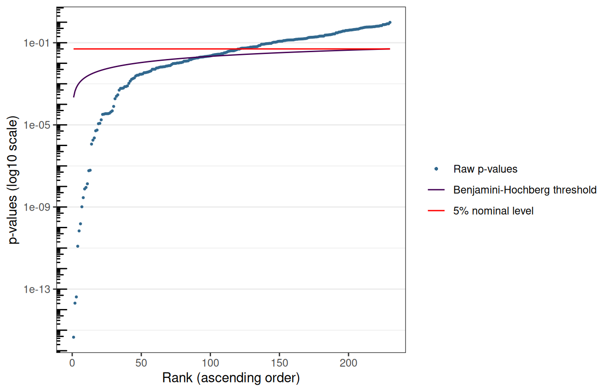
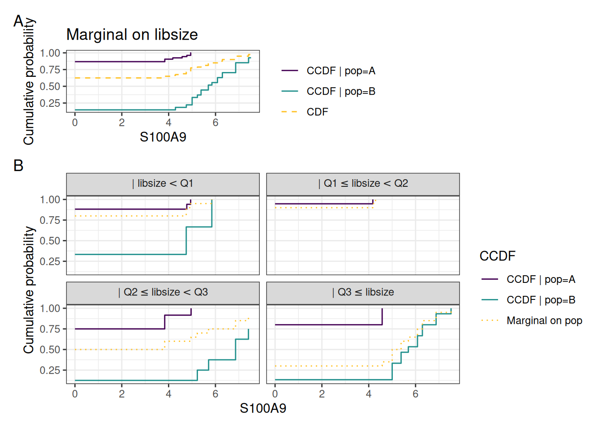

# User guide to the \`citcdf\` R package


## Overview of `citcdf`

`citcdf` performs **c**onditional **i**ndependence **t**esting through
conditional **c**umulative **d**istribution **f**unctions ([Gauthier et
al. 2026](#ref-gauthier2026)). It addresses the following null
hypothesis:
``` math
H_0: Y \perp\!\!\!\perp X \mid Z
```

by testing whether $`F_{Y \mid X, Z}(y) = F_{Y \mid Z}(y)`$. The
associated test statistic is computed across a grid of thresholds
$`\omega_1 < \dots < \omega_p`$ spanning $`Y`$, where the indicator
$`\mathbb{1}_{Y_i \le \omega_j}`$ is regressed on both $`X`$ and $`Z`$
at each threshold $`j`$. Under $`H_0`$, the coefficients $`\beta_j`$
carried by $`X`$ are all null, and thus `citcdf` test statistic is the
sum of squares whose asymptotic distribution is then a weighted mixture
of $`\chi^2_1`$.

No distributional assumption is made on $`Y`$, and in that sense
`citcdf` is *distribution-free*. It is therefore robust to
zero-inflation, multi-modality and skewness that typical occur in
single-cell RNA-seq data.

### Main user functions

Three main functions build form the `citcdf`package leverage this test
statistic:

- [`cit_asymp()`](https://sistm.github.io/citcdf/reference/cit_asymp.md):
  one hypothesis, asymptotic p-value
- [`cit_perm()`](https://sistm.github.io/citcdf/reference/cit_perm.md):
  one hypothesis, permutation p-value
- [`cit_multi()`](https://sistm.github.io/citcdf/reference/cit_multi.md):
  many outcomes at once (with a Benjamini-Hochberg adjustment), either
  asymptotic or permutation test

### Inputs

`Y` is a numeric vector. `X` and `Z` are data frames, one column per
variable, numeric or factor. Gene set analysis is available through
[`cit_gsa()`](https://sistm.github.io/citcdf/reference/cit_gsa.md) and
is not covered here.

``` r

library(citcdf)
set.seed(20260817)
```

## Testing a single hypothesis

### The data

We use the `marks`dataset, from the `bnlearn` package ([Scutari
2010](#ref-scutari2010)). It records the exam marks of 88 students in
five mathematics topics ([Mardia et al. 1979](#ref-mardia1979)). Of
note, *mechanics* and *statistics* marks are **correlated**, but the
association is mediated by the *algebra* mark (relevant to both
disciplines).

``` r

data("marks", package = "bnlearn")
str(marks)
#> 'data.frame':    88 obs. of  5 variables:
#>  $ MECH: num  77 63 75 55 63 53 51 59 62 64 ...
#>  $ VECT: num  82 78 73 72 63 61 67 70 60 72 ...
#>  $ ALG : num  67 80 71 63 65 72 65 68 58 60 ...
#>  $ ANL : num  67 70 66 70 70 64 65 62 62 62 ...
#>  $ STAT: num  81 81 81 68 63 73 68 56 70 45 ...
```

### Asymptotic test with `cit_asymp()`

$`Y`$ is the statistics mark, $`X`$ the mechanics mark. Without
conditioning:

``` r

Y <- marks$STAT
X <- data.frame(MECH = marks$MECH)

cit_asymp(Y, X)
#>       raw_pval test_statistic
#> 1 0.0003640664      0.1797552
```

Conditioning on the algebra mark asks whether mechanics adds anything
beyond algebra:

``` r

Z <- data.frame(ALG = marks$ALG)

cit_asymp(Y, X, Z)
#>    raw_pval test_statistic
#> 1 0.6204986     0.01850231
```

The evidence disappears.

**NB:**
[`cit_asymp()`](https://sistm.github.io/citcdf/reference/cit_asymp.md)
assumed neither normality nor linearity.  
It remains valid for skewed, zero-inflated or multi-modal outcomes.

Of note,
[`bnlearn::ci.test()`](https://rdrr.io/pkg/bnlearn/man/ci.test.html)
reaches the same conclusion from a Gaussian correlation statistic:

``` r

bnlearn::ci.test("STAT", "MECH", data = marks, test = "cor")$p.value
#> [1] 0.0001792015
bnlearn::ci.test("STAT", "MECH", "ALG", data = marks, test = "cor")$p.value
#> [1] 0.7060518
```

### Permutation test with `cit_perm()`

The asymptotic null distribution requires a reasonable sample size. For
small `n`,
[`cit_perm()`](https://sistm.github.io/citcdf/reference/cit_perm.md)
calibrates the same observed statistic against a permutation null:

``` r

cit_perm(Y, X, n_perm = 1000)
#>   score    raw_pval test_statistic
#> 1     0 0.000999001      0.1797552
```

`test_statistic` remains identical to the one returned by
[`cit_asymp()`](https://sistm.github.io/citcdf/reference/cit_asymp.md),
and `score` counts the permutations reaching the observed statistic: the
(unbiased) permutation p-value is then computed as
`(score + 1) / (n_perm + 1)` (so `n_perm` also fixes the smallest
reachable p-value, ie. `1/(n_perm +1)`.

Permuting $`X`$ freely would destroy its association with $`Z`$ and test
the wrong null.
[`X_perm()`](https://sistm.github.io/citcdf/reference/X_perm.md)
computes design permutations conditionally on $`Z`$:

- $`Z`$ discrete: permutes within each strata of $`Z`$
- $`Z`$ continuous: permutes by matching observations on the fitted
  value of $`X`$ given $`Z`$, following Berrett et al.
  ([2020](#ref-berrett2020)) (see
  [`?perm_cont`](https://sistm.github.io/citcdf/reference/perm_cont.md))

``` r

cit_perm(Y, X, Z = Z, n_perm = 1000)
#>   score  raw_pval test_statistic
#> 1   523 0.5234765     0.01850231
```

Both tests agree on both hypotheses.

**NB:**
[`cit_perm()`](https://sistm.github.io/citcdf/reference/cit_perm.md)
only accepts a single covariate column when `Z` is not `NULL`. Multiple
`X` with `Z` present require the asymptotic test.

### Visualization

[`plot_compare_ccdf()`](https://sistm.github.io/citcdf/reference/plot_compare_ccdf.md)
displays what the statistic compares: the CCDF of $`Y`$ given $`X`$
against its marginal counterpart. The further apart the 2 are, the
larger $`D`$:

``` r

plot_compare_ccdf(Y = data.frame(STAT = Y), X = X)
```



## Testing many outcomes with `cit_multi()`

[`cit_multi()`](https://sistm.github.io/citcdf/reference/cit_multi.md)
loops the test over the columns of a matrix `M` of `n` observations by
`r` outcomes, and returns Benjamini-Hochberg adjusted p-values
(alongside the raw ones).

### scRNA-seq data

This vignette uses `pbmc_small`, the PBMC scRNA-seq excerpt distributed
with the `SeuratObject` package ([Satija et al. 2023](#ref-satija2023))
(230 genes, 80 cells).

**NB:** `M` must be oriented *cells-by-genes*, the transpose of usual
genes-by-cells expression matrix. Also, **outcomes with no variability
must be filtered-out beforehand** (otherwise an error is triggered).

``` r

data("pbmc_small", package = "SeuratObject")
expr <- as.matrix(SeuratObject::LayerData(pbmc_small, layer = "data"))
cell_md <- pbmc_small[[]]

expr <- expr[apply(expr, 1, function(g) length(unique(g)) > 1), ]
M <- as.data.frame(t(expr))
dim(M)
#> [1]  80 230
```

The variable of interest is the cell population (`letter.idents`, two
populations). The two populations were not sequenced to comparable
depth:

``` r

tapply(cell_md$nCount_RNA, cell_md$letter.idents, median)
#>   A   B 
#> 150 353
```

Library size is therefore a candidate confounder. An unadjusted
comparison will identify significant genes that are only associated with
sequencing depth.

### Asymptotic analysis

``` r

X_pop <- data.frame(pop = cell_md$letter.idents)
Z_lib <- data.frame(libsize = cell_md$nCount_RNA)

res_unadj <- cit_multi(M, X = X_pop, test = "asymptotic", parallel = FALSE)
res_adj <- cit_multi(M, X = X_pop, Z = Z_lib, test = "asymptotic",
                     parallel = FALSE)

c(unadjusted = sum(res_unadj$pvals$adj_pval < 0.05),
  adjusted   = sum(res_adj$pvals$adj_pval < 0.05))
#> unadjusted   adjusted 
#>         89         55
```

Conditioning on library size withdraws a third of the hits. The
strongest signals — canonical monocyte markers — survive:

``` r

head(res_adj$pvals[order(res_adj$pvals$raw_pval), ], 5)
#>            raw_pval     adj_pval test_statistic
#> S100A8 1.951411e-11 4.488246e-09       246.5594
#> S100A9 7.526161e-11 8.655085e-09       250.5153
#> TYMP   3.219987e-08 2.468657e-06       256.8253
#> AIF1   9.697369e-08 5.430011e-06       205.6298
#> IFITM3 1.180437e-07 5.430011e-06       195.7231
```

`res_adj` is a list containing:

- `which_test` and `n_perm`, the test performed and the number of
  permutations (`NA` for the asymptotic test)
- `pvals`, the gene-wise raw and BH-adjusted p-values, plus the test
  statistics

The [`plot()`](https://rdrr.io/r/graphics/plot.default.html) method
sorts the raw p-values against the BH threshold and the nominal level:

``` r

plot(res_adj)
```



### Visualization

[`plot_compare_ccdf()`](https://sistm.github.io/citcdf/reference/plot_compare_ccdf.md)
details one gene. Panel A contrasts the CCDF given the cell population
with the marginal CDF. Panel B repeats the comparison within
library-size quartiles.

``` r

top_gene <- rownames(res_adj$pvals)[which.min(res_adj$pvals$raw_pval)]
plot_compare_ccdf(Y = M[, top_gene, drop = FALSE], X = X_pop, Z = Z_lib,
                  space_y = TRUE, number_y = 20)
```



### Permutation analysis

With 80 cells, the asymptotic approximation should work (low end of its
range). `test = "permutation"` confirms a few genes. `adaptive = TRUE`
(the default) spends additional computation time to increase p-value
resolution where it matters (especially for FDR-adjusted p-values): all
outcomes start at `n_perm`, and only those still significant proceed to
the larger stages of `n_perm_adaptive`.

``` r

res_perm <- cit_multi(M, X = X_pop, Z = Z_lib, test = "permutation",
                      n_perm = 100, parallel = FALSE)
#> Computing 100 permutations...
#> Computing 100 additional permutations...
#> Computing 300 additional permutations...
#> Computing 500 additional permutations...
res_perm$n_perm
#> [1]  100  200  500 1000
```

``` r

order_asymp <- rownames(res_adj$pvals[order(res_adj$pvals$adj_pval),])
reactable::reactable(data.frame(asymptotic = signif(res_adj$pvals[order_asymp, "raw_pval"], 3),
           permutation = signif(res_perm$pvals[order_asymp, "raw_pval"], 3),
           row.names = order_asymp),
           defaultPageSize=15
)
```

The orderings nearly coincide. Individual p-values, as expected, differ:
the permutation ones carry Monte Carlo noise and cannot fall below
`1 / (total permutations + 1)`.

## Practical considerations

\[ \] **Threshold grid:** `space_y = FALSE` places a threshold at every
distinct value of `Y`, while `space_y = TRUE` uses a regular grid of
`number_y` points instead, at a cost independent of `n`.  
Defaults differ:
[`cit_asymp()`](https://sistm.github.io/citcdf/reference/cit_asymp.md)
and [`cit_perm()`](https://sistm.github.io/citcdf/reference/cit_perm.md)
use the exhaustive grid,
[`cit_multi()`](https://sistm.github.io/citcdf/reference/cit_multi.md)
uses `number_y = 10`. Expect small numerical differences between a
single call and a
[`cit_multi()`](https://sistm.github.io/citcdf/reference/cit_multi.md)
run.

\[ \] **Parallelism.**
[`cit_multi()`](https://sistm.github.io/citcdf/reference/cit_multi.md)
parallelises over outcomes and defaults to `parallel = interactive()`.
Calls above set `parallel = FALSE` for reproducible builds. Drop it in
real analyses, and set `n_cpus`.

**Multiplicity.**
[`cit_multi()`](https://sistm.github.io/citcdf/reference/cit_multi.md)
returns Benjamini-Hochberg adjusted p-values in `adj_pval` for FDR
control.
[`cit_asymp()`](https://sistm.github.io/citcdf/reference/cit_asymp.md)
and [`cit_perm()`](https://sistm.github.io/citcdf/reference/cit_perm.md)
are single-hypothesis functions and do not need sich multiple-testing
adjustlent.

**Design.** The asymptotic test accepts several variables of interest
(`ncol(X) > 1`) and several covariates (`ncol(Z) > 1`). The permutation
test is less flexible accepting at most one covariate.

**Preprocessing.** Normalisation remains the user’s choice and
responsibility.

## Session information

    
[1m
[36m─ Session info ───────────────────────────────────────────────────────────────
[39m
[22m
     
[3m
[90msetting 
[39m
[23m 
[3m
[90mvalue
[39m
[23m
     version  R version 4.6.1 (2026-06-24)
     os       Ubuntu 24.04.4 LTS
     system   x86_64, linux-gnu
     ui       X11
     language en-US
     collate  C.UTF-8
     ctype    C.UTF-8
     tz       UTC
     date     2026-08-19
     pandoc   3.8.3 @ /opt/hostedtoolcache/pandoc/3.8.3/x64/ (via rmarkdown)
     quarto   NA

    
[1m
[36m─ Packages ───────────────────────────────────────────────────────────────────
[39m
[22m
     
[3m
[90mpackage     
[39m
[23m 
[3m
[90m*
[39m
[23m 
[3m
[90mversion
[39m
[23m 
[3m
[90mdate (UTC)
[39m
[23m 
[3m
[90mlib
[39m
[23m 
[3m
[90msource
[39m
[23m
     bnlearn        5.2.1   
[90m2026-07-17
[39m 
[90m[1]
[39m 
[1m
[35mRSPM
[39m
[22m
     bslib          0.12.0  
[90m2026-08-04
[39m 
[90m[1]
[39m 
[1m
[35mRSPM
[39m
[22m
     cachem         1.1.0   
[90m2024-05-16
[39m 
[90m[1]
[39m 
[1m
[35mRSPM
[39m
[22m
     citcdf       * 1.1.0   
[90m2026-08-19
[39m 
[90m[1]
[39m 
[1m
[35mlocal
[39m
[22m
     cli            3.6.6   
[90m2026-04-09
[39m 
[90m[1]
[39m 
[1m
[35mRSPM
[39m
[22m
     codetools      0.2-20  
[90m2024-03-31
[39m 
[90m[3]
[39m 
[90mCRAN (R 4.6.1)
[39m
     DBI            1.3.0   
[90m2026-02-25
[39m 
[90m[1]
[39m 
[1m
[35mRSPM
[39m
[22m
     desc           1.4.3   
[90m2023-12-10
[39m 
[90m[1]
[39m 
[1m
[35mRSPM
[39m
[22m
     digest         0.6.39  
[90m2025-11-19
[39m 
[90m[1]
[39m 
[1m
[35mRSPM
[39m
[22m
     dotCall64      1.2     
[90m2024-10-04
[39m 
[90m[1]
[39m 
[1m
[35mRSPM
[39m
[22m
     dplyr          1.2.1   
[90m2026-04-03
[39m 
[90m[1]
[39m 
[1m
[35mRSPM
[39m
[22m
     evaluate       1.0.5   
[90m2025-08-27
[39m 
[90m[1]
[39m 
[1m
[35mRSPM
[39m
[22m
     farver         2.1.2   
[90m2024-05-13
[39m 
[90m[1]
[39m 
[1m
[35mRSPM
[39m
[22m
     fastmap        1.2.0   
[90m2024-05-15
[39m 
[90m[1]
[39m 
[1m
[35mRSPM
[39m
[22m
     fs             2.1.0   
[90m2026-04-18
[39m 
[90m[1]
[39m 
[1m
[35mRSPM
[39m
[22m
     future         1.75.0  
[90m2026-07-20
[39m 
[90m[1]
[39m 
[1m
[35mRSPM
[39m
[22m
     future.apply   1.20.2  
[90m2026-02-20
[39m 
[90m[1]
[39m 
[1m
[35mRSPM
[39m
[22m
     generics       0.1.4   
[90m2025-05-09
[39m 
[90m[1]
[39m 
[1m
[35mRSPM
[39m
[22m
     ggplot2        4.0.3   
[90m2026-04-22
[39m 
[90m[1]
[39m 
[1m
[35mRSPM
[39m
[22m
     globals        0.19.1  
[90m2026-03-13
[39m 
[90m[1]
[39m 
[1m
[35mRSPM
[39m
[22m
     glue           1.8.1   
[90m2026-04-17
[39m 
[90m[1]
[39m 
[1m
[35mRSPM
[39m
[22m
     gtable         0.3.6   
[90m2024-10-25
[39m 
[90m[1]
[39m 
[1m
[35mRSPM
[39m
[22m
     htmltools      0.5.9   
[90m2025-12-04
[39m 
[90m[1]
[39m 
[1m
[35mRSPM
[39m
[22m
     htmlwidgets    1.6.4   
[90m2023-12-06
[39m 
[90m[1]
[39m 
[1m
[35mRSPM
[39m
[22m
     jquerylib      0.1.4   
[90m2021-04-26
[39m 
[90m[1]
[39m 
[1m
[35mRSPM
[39m
[22m
     jsonlite       2.0.0   
[90m2025-03-27
[39m 
[90m[1]
[39m 
[1m
[35mRSPM
[39m
[22m
     knitr          1.51    
[90m2025-12-20
[39m 
[90m[1]
[39m 
[1m
[35mRSPM
[39m
[22m
     labeling       0.4.3   
[90m2023-08-29
[39m 
[90m[1]
[39m 
[1m
[35mRSPM
[39m
[22m
     lattice        0.22-9  
[90m2026-02-09
[39m 
[90m[3]
[39m 
[90mCRAN (R 4.6.1)
[39m
     lifecycle      1.0.5   
[90m2026-01-08
[39m 
[90m[1]
[39m 
[1m
[35mRSPM
[39m
[22m
     listenv        1.0.0   
[90m2026-06-22
[39m 
[90m[1]
[39m 
[1m
[35mRSPM
[39m
[22m
     magrittr       2.0.5   
[90m2026-04-04
[39m 
[90m[1]
[39m 
[1m
[35mRSPM
[39m
[22m
     Matrix         1.7-5   
[90m2026-03-21
[39m 
[90m[3]
[39m 
[90mCRAN (R 4.6.1)
[39m
     mitools        2.4     
[90m2019-04-26
[39m 
[90m[1]
[39m 
[1m
[35mRSPM
[39m
[22m
     otel           0.2.0   
[90m2025-08-29
[39m 
[90m[1]
[39m 
[1m
[35mRSPM
[39m
[22m
     parallelly     1.48.0  
[90m2026-06-29
[39m 
[90m[1]
[39m 
[1m
[35mRSPM
[39m
[22m
     patchwork      1.3.2   
[90m2025-08-25
[39m 
[90m[1]
[39m 
[1m
[35mRSPM
[39m
[22m
     pbapply        1.7-4   
[90m2025-07-20
[39m 
[90m[1]
[39m 
[1m
[35mRSPM
[39m
[22m
     pillar         1.11.1  
[90m2025-09-17
[39m 
[90m[1]
[39m 
[1m
[35mRSPM
[39m
[22m
     pkgconfig      2.0.3   
[90m2019-09-22
[39m 
[90m[1]
[39m 
[1m
[35mRSPM
[39m
[22m
     pkgdown        2.2.1   
[90m2026-07-07
[39m 
[90m[1]
[39m 
[1m
[35many (@2.2.1)
[39m
[22m
     progressr      1.0.0   
[90m2026-07-04
[39m 
[90m[1]
[39m 
[1m
[35mRSPM
[39m
[22m
     R6             2.6.1   
[90m2025-02-15
[39m 
[90m[1]
[39m 
[1m
[35mRSPM
[39m
[22m
     ragg           1.5.2   
[90m2026-03-23
[39m 
[90m[1]
[39m 
[1m
[35mRSPM
[39m
[22m
     RColorBrewer   1.1-3   
[90m2022-04-03
[39m 
[90m[1]
[39m 
[1m
[35mRSPM
[39m
[22m
     Rcpp           1.1.2   
[90m2026-07-05
[39m 
[90m[1]
[39m 
[1m
[35mRSPM
[39m
[22m
     reactable      0.4.5   
[90m2025-12-01
[39m 
[90m[1]
[39m 
[1m
[35mRSPM
[39m
[22m
     reactR         0.6.1   
[90m2024-09-14
[39m 
[90m[1]
[39m 
[1m
[35mRSPM
[39m
[22m
     rlang          1.3.0   
[90m2026-07-05
[39m 
[90m[1]
[39m 
[1m
[35mRSPM
[39m
[22m
     rmarkdown      2.31    
[90m2026-03-26
[39m 
[90m[1]
[39m 
[1m
[35mRSPM
[39m
[22m
     S7             0.2.2   
[90m2026-04-22
[39m 
[90m[1]
[39m 
[1m
[35mRSPM
[39m
[22m
     sass           0.4.10  
[90m2025-04-11
[39m 
[90m[1]
[39m 
[1m
[35mRSPM
[39m
[22m
     scales         1.4.0   
[90m2025-04-24
[39m 
[90m[1]
[39m 
[1m
[35mRSPM
[39m
[22m
     sessioninfo    1.2.4   
[90m2026-06-04
[39m 
[90m[1]
[39m 
[1m
[35many (@1.2.4)
[39m
[22m
     SeuratObject   5.4.0   
[90m2026-04-11
[39m 
[90m[1]
[39m 
[1m
[35mRSPM
[39m
[22m
     sp             2.2-3   
[90m2026-07-19
[39m 
[90m[1]
[39m 
[1m
[35mRSPM
[39m
[22m
     spam           2.11-4  
[90m2026-05-29
[39m 
[90m[1]
[39m 
[1m
[35mRSPM
[39m
[22m
     survey         4.5     
[90m2026-02-24
[39m 
[90m[1]
[39m 
[1m
[35mRSPM
[39m
[22m
     survival       3.8-6   
[90m2026-01-16
[39m 
[90m[3]
[39m 
[90mCRAN (R 4.6.1)
[39m
     systemfonts    1.3.2   
[90m2026-03-05
[39m 
[90m[1]
[39m 
[1m
[35mRSPM
[39m
[22m
     textshaping    1.0.5   
[90m2026-03-06
[39m 
[90m[1]
[39m 
[1m
[35mRSPM
[39m
[22m
     tibble         3.3.1   
[90m2026-01-11
[39m 
[90m[1]
[39m 
[1m
[35mRSPM
[39m
[22m
     tidyselect     1.2.1   
[90m2024-03-11
[39m 
[90m[1]
[39m 
[1m
[35mRSPM
[39m
[22m
     vctrs          0.7.3   
[90m2026-04-11
[39m 
[90m[1]
[39m 
[1m
[35mRSPM
[39m
[22m
     viridisLite    0.4.3   
[90m2026-02-04
[39m 
[90m[1]
[39m 
[1m
[35mRSPM
[39m
[22m
     withr          3.0.3   
[90m2026-06-19
[39m 
[90m[1]
[39m 
[1m
[35mRSPM
[39m
[22m
     xfun           0.60    
[90m2026-07-09
[39m 
[90m[1]
[39m 
[1m
[35mRSPM
[39m
[22m
     yaml           2.3.12  
[90m2025-12-10
[39m 
[90m[1]
[39m 
[1m
[35mRSPM
[39m
[22m

    
[90m [1] /home/runner/work/_temp/Library
[39m
    
[90m [2] /opt/R/4.6.1/lib/R/site-library
[39m
    
[90m [3] /opt/R/4.6.1/lib/R/library
[39m
     
[41m
[37m*
[39m
[49m ── Packages attached to the search path.

    
[1m
[36m──────────────────────────────────────────────────────────────────────────────
[39m
[22m

## References

Berrett, Thomas B., Yi Wang, Rina Foygel Barber, and Richard J.
Samworth. 2020. “The Conditional Permutation Test for Independence While
Controlling for Confounders.” *Journal of the Royal Statistical Society
Series B: Statistical Methodology* 82 (1): 175–97.
<https://doi.org/10.1111/rssb.12340>.

Gauthier, Marine, Denis Agniel, Sara Fallet, Kalidou Ba, Rodolphe
Thiébaut, and Boris P. Hejblum. 2026. “Distribution-Free Complex
Hypothesis Testing for Single-Cell RNA-Seq Differential Expression
Analysis.” *bioRxiv*, 445165.
<https://doi.org/10.1101/2021.05.21.445165>.

Mardia, Kanti V., John T. Kent, and John M. Bibby. 1979. *Multivariate
Analysis*. Academic Press.

Satija, Rahul, Paul Hoffman, Yuhan Hao, et al. 2023. *SeuratObject: Data
Structures for Single Cell Data*.
<https://CRAN.R-project.org/package=SeuratObject>.

Scutari, Marco. 2010. “Learning Bayesian Networks with the bnlearn R
Package.” *Journal of Statistical Software* 35 (3): 1–22.
<https://doi.org/10.18637/jss.v035.i03>.
